# imgaug-tf

An image augmentation library for tensorflow. 
This library is implemented in TF native and has been confirmed to work with TPU.

## Installation
```bash
%env TOKEN=[your secret access token]
!pip install -U git+https://$$TOKEN@github.com/hirune924/imgaug-tf
```
Required packages:
- tensorflow (2.6.3 or higher recommended)
- tensorflow_addons (0.14.0 or higher recommended)
- tensorflow_probability (0.14.1 or higher recommended)

## Quick Start
imgaugtf is implemented to work simply with tf.data.
Example of use single transform.
```python
import imgaugtf

image = imgaugtf.random_solarize_add(image, addition=30, prob=0.5)
```
You can also apply transform for a mask as same as a image.
```python
import imgaugtf

image = imgaugtf.seg.random_solarize_add(image, mask, addition=30, prob=0.5)
```
You can also randomly select n of multiple transformations to apply, as shown below. You can use mixup or cutmix on batched images.
```python
import imgaugtf

def augmentation(example):
    example['image'] = imgaugtf.random_resized_crop(example['image'], size=[256, 256], prob=1.0)
    example['image'] = imgaugtf.apply_n(example['image'], functions=imgaugtf.OPERATORS, num_ops=2, prob=1.0)
    return example

def batch_augmentation(example, num_class=120):
    image = example['image']
    label = tf.one_hot(example['label'], num_class)
    
    image, label = imgaugtf.cutmix(image, label)
    return image, label

result = next(iter(dataset.map(augmentation).batch(15).map(batch_augmentation)))

for i in range(10):
    plt.imshow(result[0][i])
    plt.show()
```
functions is list of dict like this example. dict has keys of 'func' and 'option'. you can customize it you like.
```python
[
    {"func": imgaugtf.random_cutout, "option": {"num_holes": 8, "hole_size": 20, "replace": 0}},
    {"func": imgaugtf.random_solarize, "option": {"threshold": 128}},
    {"func": imgaugtf.random_solarize_add, "option": {"addition": 30, "threshold": 128}},
]
```

## Augmentations
### pixel
|  | image | mask |
| :---: | :---: | :---: |
| original | 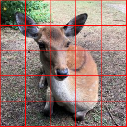 | 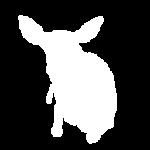 |
| random_solarize | 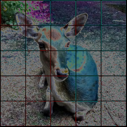 |  |
| random_solarize_add | 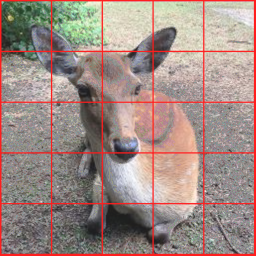 |  |
| random_color | |  |
|  random_contrast | |  |
| random_brightness | 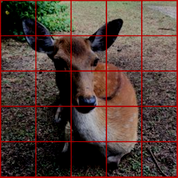|  |
| random_posterize |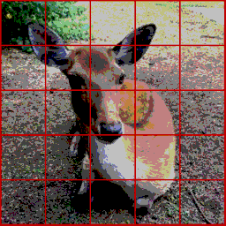 |  |
| random_invert |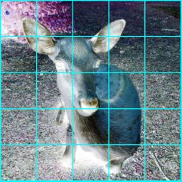 |  |
| random_equalize | 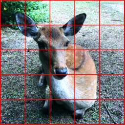 |  |
| random_sharpness |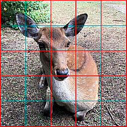 |  |
| random_autocontrast |  |  |
| random_hsv_in_yiq |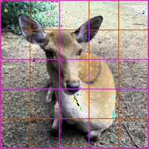 |  |
| random_gaussian_filter2d | |  |
| random_mean_filter2d | 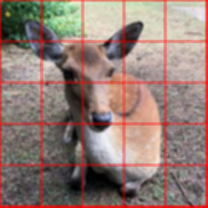|  |
| random_median_filter2d | |  |
| random_cutout | 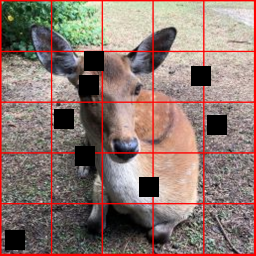 |  |
| random_gray | 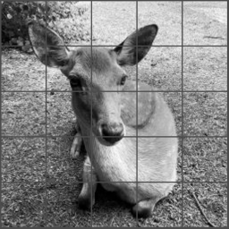 |  |


### geometory
|  | image | mask |
| :---: | :---: | :---: |
| original |  |  |
| random_flip_left_right | 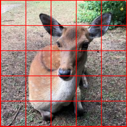 | 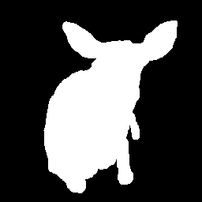 |
| random_flip_up_down | 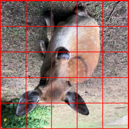 |  |
| random_resized_crop | 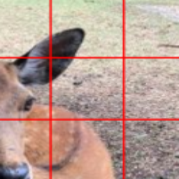 |  |
| random_rotate | 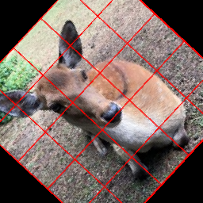 | 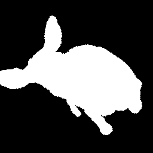 |
| random_translate_x | 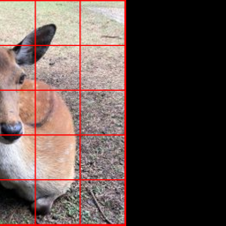 | 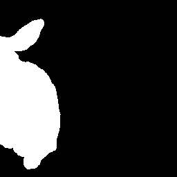 |
| random_translate_y | 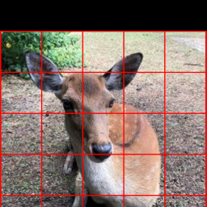 | 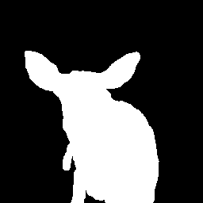 |
| random_shear_x | 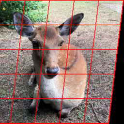 | 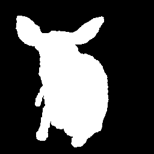 |
| random_shear_y | 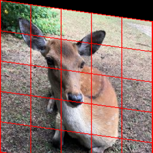 | 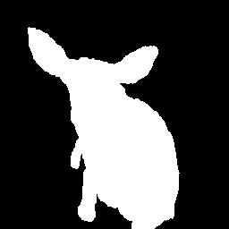 |
| random_zoom | 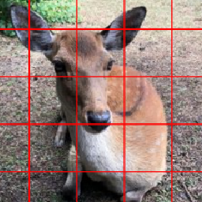 |  |
| random_grid_shuffle | 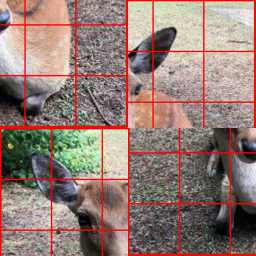 | 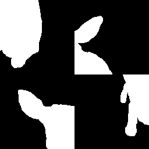 |


### blend
* mixup
* cutmix

### compose
* apply_one
* apply_n

